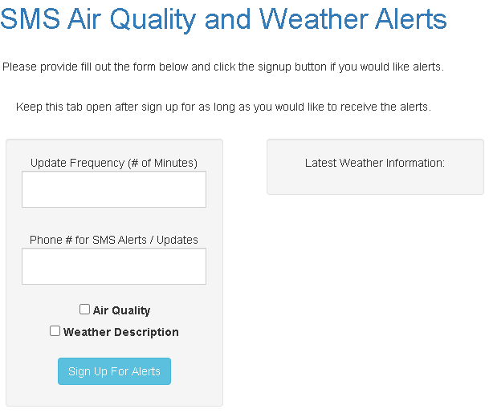
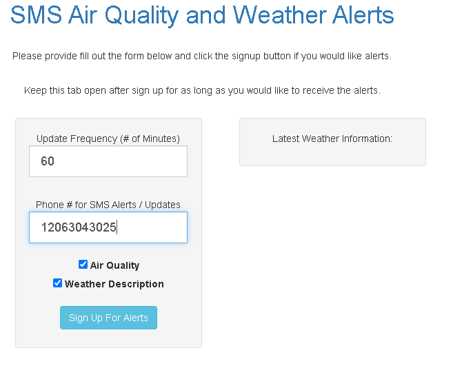
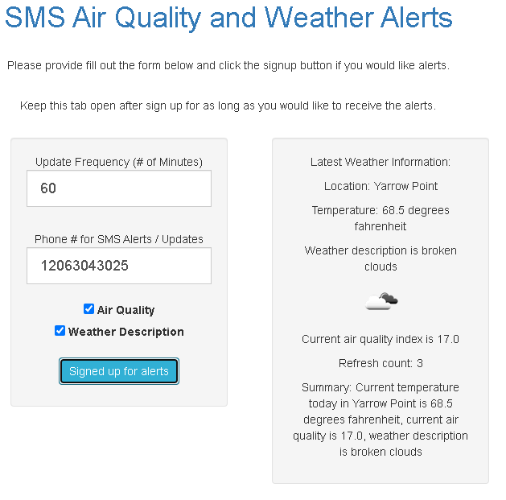

# Air-Quality-SMS-Alerts

## Overview

### Project summary

Javascript application that sends SMS alerts for air quality and weather notifications.

Include the link to your Devpost project page here: [Devpost](https://...)

### Authors

* **John Hentrich** - Devpost ID – Penn email – [GitHub](https://github.com/johnhentrich)
* **Chin Jung Cheng** - chengcj – chengcj@seas.upenn.edu – [GitHub](https://github.com/chengcj-upenn)
* **Name** - Devpost ID – Penn email – [GitHub](https://github.com/user_name)

## Usage

You start the application by using a browser to open the **./index.html** file

In the application, you will need to enter the update frequencey (in minutes) and your cell phone number (with country code) to get the SMS alerts.

### Prerequisites

You just need a browser that enables javascript.

### Installation

Download the git repository:
```
git clone https://github.com/johnhentrich/Air-Quality-SMS-Alerts
```
edit the file: ./js/index.js 
You will need to register an account with Twilio to update the following variables in the index.js file:
```
  var TWILIO_SID = "your Twilio SID";
  var TWILIO_PHONE = "your Twilio phone";
  var TWILIO_KEY = "your Twilio KEY";
```

After updating these variables, you can then start using the application.

### Deployment

Give a step-by-step rundown of how to **use** your project. Including screenshots in this section can be highly effective for highlighting specific features of your project.

Step 1: run ./index.html



Step 2: input update intervals and your phone number and click button



Step 3: output of the app includes weather info and air quality



Step 4: pause update by click on the button again


## Additional information

### Tools used

Which frameworks, libraries, or other tools did you use to create your project?

* [Tool 1](https://openweathermap.org/api) - Weather info
* [Tool 2](https://www.iqair.com/us/air-pollution-data-api) - Air quality info
* [Tool 3](https://www.twilio.com/docs/usage/api) - Text message service

### Acknowledgments

Inspired by California wildfires and the need to know when the air quality is good enough to open the window.
